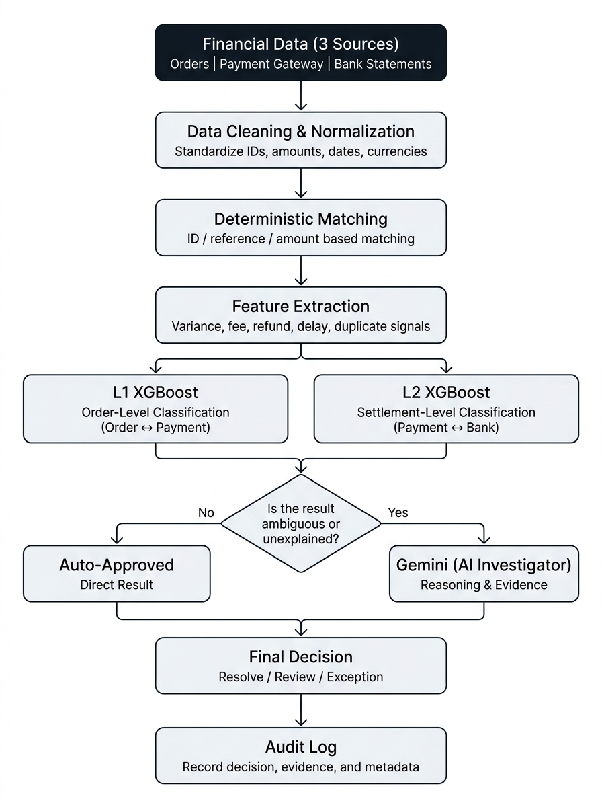

# ReconcileX

**AI-powered multi-source financial reconciliation.**


🚀 **Live Demo:** [demo](https://reconcile-production-f3bb.up.railway.app)  
📹 **Video Demo Walkthrough:** [demo vedio](https://drive.google.com/file/d/1M0mHIm0XfRHXq9AgD6gQpQ_likno67Nd/view?usp=sharing)

---

## What It Does

ReconcileX matches financial records across three sources — **store orders**, **payment gateway reports**, and **bank statements** — to detect discrepancies, missing settlements, and fee leakage with high speed and audit-grade precision.


## Key Metrics

| Metric | Benchmark Performance |
|--------|----------------------|
| **Dataset Size** | 1,244 multi-source transactions (ReconRiver) |
| **Pipeline Speed** | ~510 ms total batch execution |
| **Throughput** | ~2,439 records / second |
| **ML Accuracy** | 100% classification on held-out test split |
| **Auto-Resolve Rate** | 84.89% resolved with zero manual intervention |
| **AI Invocation Rate** | ~2.5% selective routing (only ambiguous exceptions) |

---

## AI Architecture

<div align="center">
  
</div>

### Multi-Stage Pipeline Overview

| Stage | Module | Responsibility |
|:---:|---|---|
| **1** | `ingestion.py` | Validates schemas, parses CSVs, and normalizes column headers across sources |
| **2** | `normalization.py` | Cleans currencies, standardizes timestamps, and canonicalizes amounts |
| **3** | `matching.py` | Performs L1 (Order ↔ Gateway) & L2 (Settlement ↔ Bank Deposit) join logic |
| **4** | `discrepancy.py` | Computes gross, fee, and deposit variances; tags anomaly indicators |
| **5** | `ml_classifier.py` | Dual XGBoost models classify discrepancies into fine-grained root cause classes |
| **6** | `ai_investigator.py` | Selective Gemini 2.0 Flash agent investigates edge cases & drafts audit narratives |
| **7** | `policy_engine.py` | Enforces zero-fabrication policies and delivers final resolution verdicts |
| **8** | `database.py` | Persists reconciled batches, ledger trails, and audit logs into SQLite |

### ML Layer — Dual XGBoost Models

- **L1 Model (Order ↔ Gateway):** 15 discrete classes (e.g. `MATCHED`, `FEE_MISMATCH`, `AMOUNT_MISMATCH`, `MISSING_INTERNAL`, `MISSING_PROCESSOR`, `DUPLICATE_INTERNAL`, `CURRENCY_MISMATCH`, `PARTIAL_REFUND`, etc.)
- **L2 Model (Settlement ↔ Bank):** 6 classes (e.g. `MATCHED`, `AMOUNT_MISMATCH`, `LATE_SETTLEMENT`, `MISSING_BANK_SETTLEMENT`, `DUPLICATE_BANK_ENTRY`, etc.)
- **Features:** Amount variances, fee delta, timing differences, string similarity scores, status flags.

### AI Layer & Policy Engine

- **Selective Routing:** Gemini 2.0 Flash is triggered only when ML confidence is marginal (<0.70) or variance exceeds standard policy thresholds (~2.5% of records).
- **Structured Audit Evidence:** Outputs JSON with root-cause diagnosis, confidence score, itemized evidence chain, and plain-English controller commentary.
- **Zero-Force Policy:** The policy engine never fabricates a match. High confidence matches are auto-resolved; ambiguous anomalies are surfaced for human review.

---

## File Structure

```
ReconcileX/
├── backend/
│   ├── api/                    # REST route endpoints
│   │   ├── batches.py          # Batch upload, status & run execution
│   │   ├── export.py           # CSV & JSON audit export
│   │   └── records.py          # Detailed transaction lookup & ledger trails
│   ├── data/                   # Test datasets & benchmark files
│   │   ├── mini/               # 6-order rapid demo CSVs
│   │   └── reconriver/         # Full 1,244-record benchmark suite
│   ├── ml/                     # Machine learning models & training
│   │   ├── features.py         # Tabular feature engineering
│   │   ├── train.py            # XGBoost training pipeline
│   │   ├── l1_model.joblib     # Pretrained L1 model
│   │   └── l2_model.joblib     # Pretrained L2 model
│   ├── models/                 # Schemas & ORM models
│   │   ├── database.py         # SQLite connection & database operations
│   │   └── schemas.py          # Pydantic models for validation
│   ├── services/               # Core reconciliation pipeline
│   │   ├── ai_investigator.py  # Gemini 2.0 Flash AI agent
│   │   ├── discrepancy.py      # Delta & mismatch calculations
│   │   ├── ingestion.py        # CSV parsing & column mapping
│   │   ├── matching.py         # Multi-tier deterministic matcher
│   │   ├── ml_classifier.py    # XGBoost inference service
│   │   ├── normalization.py    # Data cleaning & standardization
│   │   ├── policy_engine.py    # Resolution decision engine
│   │   └── reconciliation.py   # Master pipeline coordinator
│   ├── config.py               # Environment configuration
│   ├── main.py                 # FastAPI application entrypoint
│   └── requirements.txt        # Backend dependencies
├── docs/                       # Documentation assets
│   └── ai_architecture.jpg     # Architecture diagram
├── frontend/
│   ├── app/                    # Next.js App Router
│   │   ├── audit/              # Audit reports & export view
│   │   ├── dashboard/          # Financial health & overview
│   │   ├── evaluation/         # Benchmark & accuracy evaluation
│   │   ├── exceptions/         # Exception triage & [id] deep dive
│   │   ├── reconciliation/     # Orders and payouts matching tables
│   │   ├── settings/           # Policy & configuration settings
│   │   ├── globals.css         # Styling & design system
│   │   └── page.tsx            # Cinematic intro page
│   ├── components/             # Reusable UI component library
│   │   ├── layout/             # Header, Sidebar, Navigation
│   │   ├── providers/          # Query, Theme & Client providers
│   │   ├── ui/                 # Buttons, Badges, Modals, Cards
│   │   └── upload/             # CSV Uploader with built-in demo data
│   ├── lib/                    # API client, TypeScript types, utilities
│   ├── package.json            # Frontend dependencies
│   └── tailwind.config.ts      # Tailwind styling configuration
└── README.md                   # Project documentation
```

---

## Tech Stack

| Layer | Technology |
|-------|-----------|
| **Frontend** | Next.js 16 (App Router), React 19, TypeScript, Tailwind CSS, Lucide Icons |
| **Backend** | FastAPI, Python 3.10+, SQLite, Pydantic |
| **ML Engine** | XGBoost (Dual L1 & L2 Classifiers), Scikit-learn, Joblib |
| **AI Agent** | Google Gemini 2.0 Flash via Google GenAI SDK |

---

## Quick Start

### 1. Backend Setup

```bash
cd backend
python -m venv venv
# On Windows: .\venv\Scripts\activate
# On macOS/Linux: source venv/bin/activate

pip install -r requirements.txt

# Configure environment
cp .env.example .env
# Set your GEMINI_API_KEY in .env

# Run server (Pretrained models included)
python -m uvicorn main:app --host 127.0.0.1 --port 8000 --reload
```

- API Server: `http://127.0.0.1:8000`
- Interactive Swagger Docs: `http://127.0.0.1:8000/docs`

### 2. Frontend Setup

```bash
cd frontend
npm install
npm run dev
```

- Web App: `http://localhost:3000`


**What the video covers:**
- **Zero-State Dashboard:** Clean initialization ready for live uploads or instant verification.
- **Multi-Source Ingestion & Matching:** Reconciling Store Orders, Payment Gateway, and Bank Statements.
- **XGBoost Anomaly Classification:** Sub-second root cause classification across L1 and L2 transactions.
- **Gemini 2.0 Flash AI Explanations:** Audit-ready merchant explanations, evidence points, and recommended actions.
- **Merchant Detail Views:** Transparent evidence verification and status breakdowns.

---

## License

MIT License. Built for Razorpay AI Buildathon 2026.
